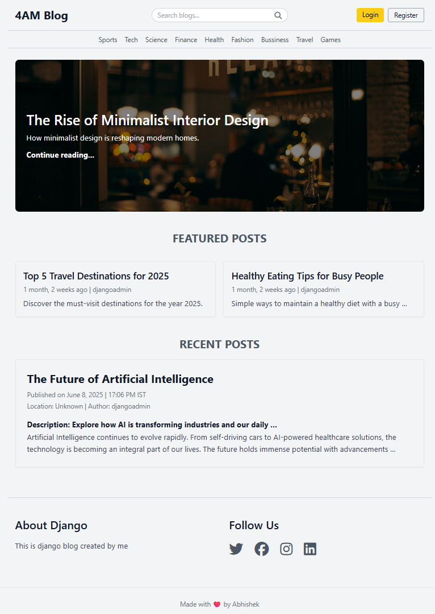
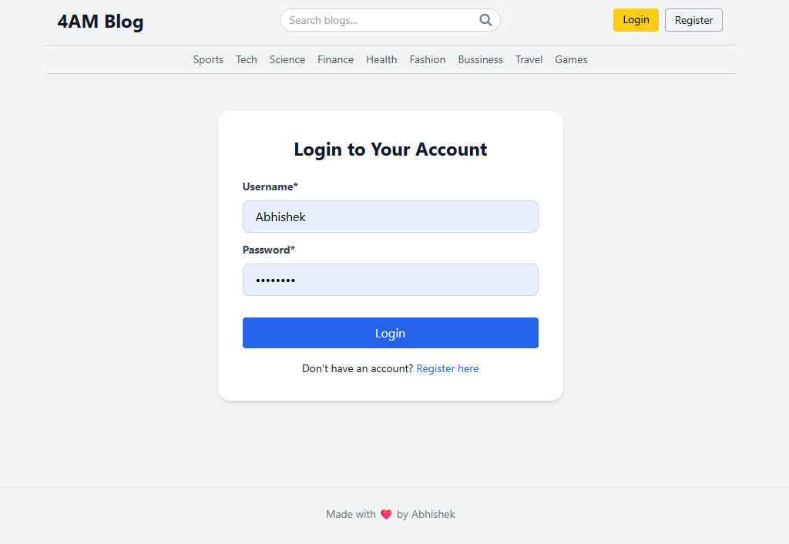
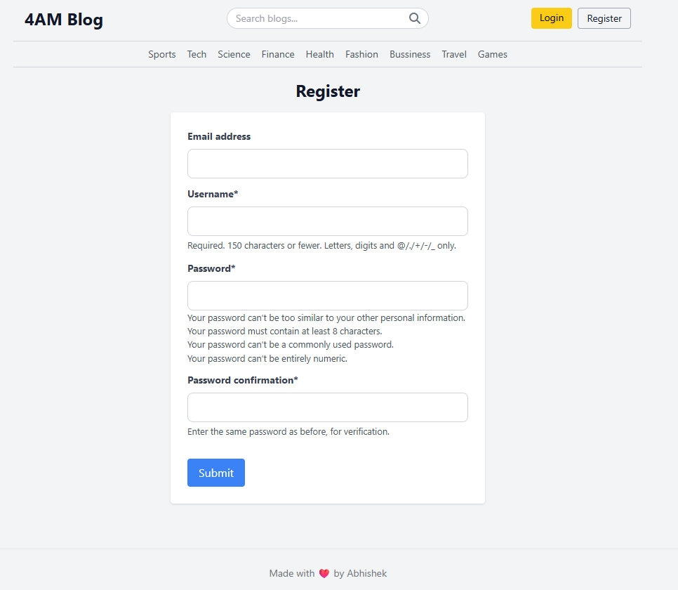
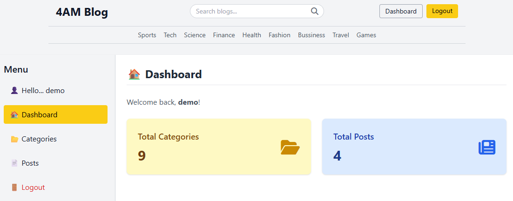
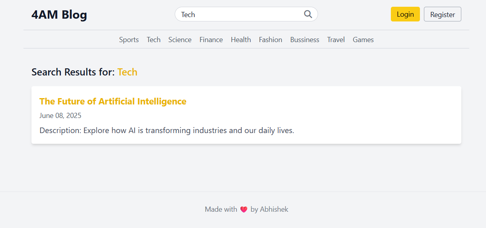

# 🕓 4AM Blog – A Django-Powered Blogging Platform

Welcome to the 4AM Blog — a clean, dynamic blogging web application built with Django. It supports category-based browsing, full-text search, user authentication, and a personalized dashboard for managing posts.

---

## 🔥 Features

- 🏠 Home page with latest blog highlights
- 🔎 Full-text blog search
- 🗂️ Category-based post filtering
- 📝 Individual blog view with slugs
- 🧑‍💻 User registration & login
- 🧾 User dashboard with post management
- 🖼️ Media support for blog images (via Django's `MEDIA_URL`)
- 💻 Admin Panel for full control

---

## 🧪 Demo Credentials

**User Login:**  
👤 ID: `demo`  
🔐 Password: `demo12345`

**Admin Login:**  
👑 ID: `djangoadmin`  
🔐 Password: `admin12345`  
URL: [http://127.0.0.1:8000/admin/](http://127.0.0.1:8000/admin/)

---

## 📸 Screenshots

### 🏠 Home Page  


### 🔐 Login  


### 🆕 Register  


### 📋 Dashboard  


### 🔍 Search  


> 📁 Save your screenshots in a folder named `screenshots/` in the project root to use the above markdown image references.

---

## 🚀 Getting Started

### 1. Clone the repository

```bash
git clone https://github.com/yourusername/4am-blog.git
cd 4am-blog
````

### 2. Create and activate virtual environment

```bash
python -m venv env
env\Scripts\activate        # On Windows
# source env/bin/activate   # On macOS/Linux
```

### 3. Install dependencies

```bash
pip install -r requirements.txt
```

### 4. Apply migrations

```bash
python manage.py makemigrations
python manage.py migrate
```

### 5. Run development server

```bash
python manage.py runserver
```

Visit: [http://127.0.0.1:8000/](http://127.0.0.1:8000/)

---

## 🔗 URL Patterns

| Route               | Description                     |
| ------------------- | ------------------------------- |
| `/`                 | Home page (latest blogs)        |
| `/blogs/search/?q=` | Search blogs                    |
| `/blogs/<slug>/`    | Individual blog detail          |
| `/category/<id>/`   | Blogs by category               |
| `/register/`        | User registration               |
| `/login/`           | Login page                      |
| `/logout/`          | Logout                          |
| `/dashboard/`       | User dashboard (CRUD for posts) |
| `/admin/`           | Django admin panel              |

---

## 🧾 License

This project is licensed under the **MIT License** – feel free to use and modify.

---

## 👨‍💻 Author

**Abhishek Kumar**
GitHub: [@abh0x1](https://github.com/abh0x1)

```

Let me know if you want a `live demo link`, `.env template`, or `deployment to Render/Heroku` instructions added too.
```
